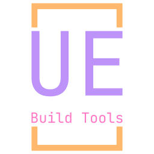

<a name="readme-top"></a>
[![Contributors][contributors-shield]][contributors-url]
[![Forks][forks-shield]][forks-url]
[![Stargazers][stars-shield]][stars-url]
[![Issues][issues-shield]][issues-url]
[![MIT License][license-shield]][license-url]
[![LinkedIn][linkedin-shield]][linkedin-url]

<br />
<div align="center">
  <a href="https://github.com/IT-Hock/UEBuildTools">
    
  </a>

<h3 align="center">
    UEBuildTools
</h3>

  <p align="center">
    Unreal Engine Build Tools are tools used by us to execute certain tasks in Unreal Engine projects.
    <br />
    <a href="https://github.com/IT-Hock/UEBuildTools/wiki"><strong>Explore the docs »</strong></a>
    <br />
    <br />
    <a href="https://github.com/IT-Hock/UEBuildTools/issues">Report Bug</a>
    ·
    <a href="https://github.com/IT-Hock/UEBuildTools/issues">Request Feature</a>
  </p>
</div>

<details>
  <summary>Table of Contents</summary>
  <ol>
    <li>
      <a href="#about-the-project">About The Project</a>
      <ul>
        <li><a href="#built-with">Built With</a></li>
      </ul>
    </li>
    <li>
      <a href="#getting-started">Getting Started</a>
      <ul>
        <li><a href="#prerequisites">Prerequisites</a></li>
        <li><a href="#installation">Installation</a></li>
      </ul>
    </li>
    <li><a href="#usage">Usage</a></li>
    <li><a href="#roadmap">Roadmap</a></li>
    <li><a href="#contributing">Contributing</a></li>
    <li><a href="#license">License</a></li>
  </ol>
</details>

## About The Project

<div align="center">
    
</div>

Currently the following things are available:
- Generating a C++ Header with Version Information from Git using a template file
- Modifying the Version Information in the Project Settings of Unreal Engine
- Modifying the Version Information for the Crash Report Client

<p align="right">(<a href="#readme-top">back to top</a>)</p>

### Built With

* [](https://www.python.org/)
* [](https://www.jetbrains.com/pycharm/)
* [](https://www.unrealengine.com/)
* [](https://git-scm.com/)

<p align="right">(<a href="#readme-top">back to top</a>)</p>

## Getting Started

The application currently only contains a "main.py" that does everything.

### Prerequisites

* Python 3.9
  * [GitPython](https://gitpython.readthedocs.io/en/stable/)
  * [argparse](https://docs.python.org/3/library/argparse.html)
  * [parse](https://pypi.org/project/parse/)
* Git

### Installation

The repository contains a requirements.txt file that can be used to install the required packages.

### Using a virtual environment:
```shell
python -m venv venv
source venv/bin/activate
pip install -r requirements.txt
```

### Without a virtual environment:
```shell
pip install -r requirements.txt
```

After that you can run the script with the following command:

```shell
python main.py --dir /path/to/git/repo
```

<p align="right">(<a href="#readme-top">back to top</a>)</p>

## Usage

The following arguments are available

### --dir (required)

The directory of the git repository

### --log

- Default: "INFO"

The log level. Possible values are "DEBUG", "INFO", "WARNING", "ERROR", "CRITICAL"

### --game

- Default: "Game"

The name of the game, will be prefixed to "ProjectDisplayedTitle"

### --output

- Default: "version.h"

The output file for the generated header file

### --template

- Default: "version.tpl"

The template file for the generated header file

Example:
```c
#pragma once

#define VERSION_CHANGELIST "{{changelist}}"
#define VERSION_BRANCH "{{branch}}"
#define VERSION_VISIBILITY "{{visibility}}"
#define VERSION_SHORT "{{versionShort}}"
#define VERSION_FULL "{{version}}"
#define VERSION_TIME __DATE__ "/" __TIME__
#define VERSION_PUBLIC {{isPublic}}

#define VERSION_STRING "Version " VERSION_FULL " (" VERSION_TIME ") [" VERSION_VISIBILITY "] <" VERSION_BRANCH "/" VERSION_SHORT "> ChangeList: " VERSION_CHANGELIST
```

### --default-game

- Default: None

The DefaultGame.ini file that should be updated

### --no-update-default-game

Do not update the DefaultGame.ini file

### --crash-report-client

- Default: "CrashReportClient.ini"

The CrashReportClient.ini file that should be updated

### --no-update-crash-report-client

Do not update the CrashReportClient.ini file

<p align="right">(<a href="#readme-top">back to top</a>)</p>

## Roadmap

Since this project was developed for internal use, there are currently no plans to expand the functionality.

See the [open issues](https://github.com/IT-Hock/UEBuildTools/issues) for a full list of proposed features (and known issues).

<p align="right">(<a href="#readme-top">back to top</a>)</p>

## Contributing

Contributions are what make the open source community such an amazing place to learn, inspire, and create. Any contributions you make are **greatly appreciated**.

If you have a suggestion that would make this better, please fork the repo and create a pull request. You can also simply open an issue with the tag "enhancement".
Don't forget to give the project a star! Thanks again!

1. Fork the Project
2. Create your Feature Branch (`git checkout -b feature/AmazingFeature`)
3. Commit your Changes (`git commit -m 'Add some AmazingFeature'`)
4. Push to the Branch (`git push origin feature/AmazingFeature`)
5. Open a Pull Request

<p align="right">(<a href="#readme-top">back to top</a>)</p>

## License

Distributed under the GNU AFFERO GENERAL PUBLIC LICENSE.
See `LICENSE.txt` for more information.

<p align="right">(<a href="#readme-top">back to top</a>)</p>

[contributors-shield]: https://img.shields.io/github/contributors/IT-Hock/UEBuildTools.svg?style=for-the-badge
[contributors-url]: https://github.com/IT-Hock/UEBuildTools/graphs/contributors
[forks-shield]: https://img.shields.io/github/forks/IT-Hock/UEBuildTools.svg?style=for-the-badge
[forks-url]: https://github.com/IT-Hock/UEBuildTools/network/members
[stars-shield]: https://img.shields.io/github/stars/IT-Hock/UEBuildTools.svg?style=for-the-badge
[stars-url]: https://github.com/IT-Hock/UEBuildTools/stargazers
[issues-shield]: https://img.shields.io/github/issues/IT-Hock/UEBuildTools.svg?style=for-the-badge
[issues-url]: https://github.com/IT-Hock/UEBuildTools/issues
[license-shield]: https://img.shields.io/github/license/IT-Hock/UEBuildTools.svg?style=for-the-badge
[license-url]: https://github.com/IT-Hock/UEBuildTools/blob/master/LICENSE.txt
[linkedin-shield]: https://img.shields.io/badge/-LinkedIn-black.svg?style=for-the-badge&logo=linkedin&colorB=555
[linkedin-url]: https://linkedin.com/in/othneildrew
[product-screenshot]: images/screenshot.png
[Next.js]: https://img.shields.io/badge/next.js-000000?style=for-the-badge&logo=nextdotjs&logoColor=white
[Next-url]: https://nextjs.org/
[React.js]: https://img.shields.io/badge/React-20232A?style=for-the-badge&logo=react&logoColor=61DAFB
[React-url]: https://reactjs.org/
[Vue.js]: https://img.shields.io/badge/Vue.js-35495E?style=for-the-badge&logo=vuedotjs&logoColor=4FC08D
[Vue-url]: https://vuejs.org/
[Angular.io]: https://img.shields.io/badge/Angular-DD0031?style=for-the-badge&logo=angular&logoColor=white
[Angular-url]: https://angular.io/
[Svelte.dev]: https://img.shields.io/badge/Svelte-4A4A55?style=for-the-badge&logo=svelte&logoColor=FF3E00
[Svelte-url]: https://svelte.dev/
[Laravel.com]: https://img.shields.io/badge/Laravel-FF2D20?style=for-the-badge&logo=laravel&logoColor=white
[Laravel-url]: https://laravel.com
[Bootstrap.com]: https://img.shields.io/badge/Bootstrap-563D7C?style=for-the-badge&logo=bootstrap&logoColor=white
[Bootstrap-url]: https://getbootstrap.com
[JQuery.com]: https://img.shields.io/badge/jQuery-0769AD?style=for-the-badge&logo=jquery&logoColor=white
[JQuery-url]: https://jquery.com
